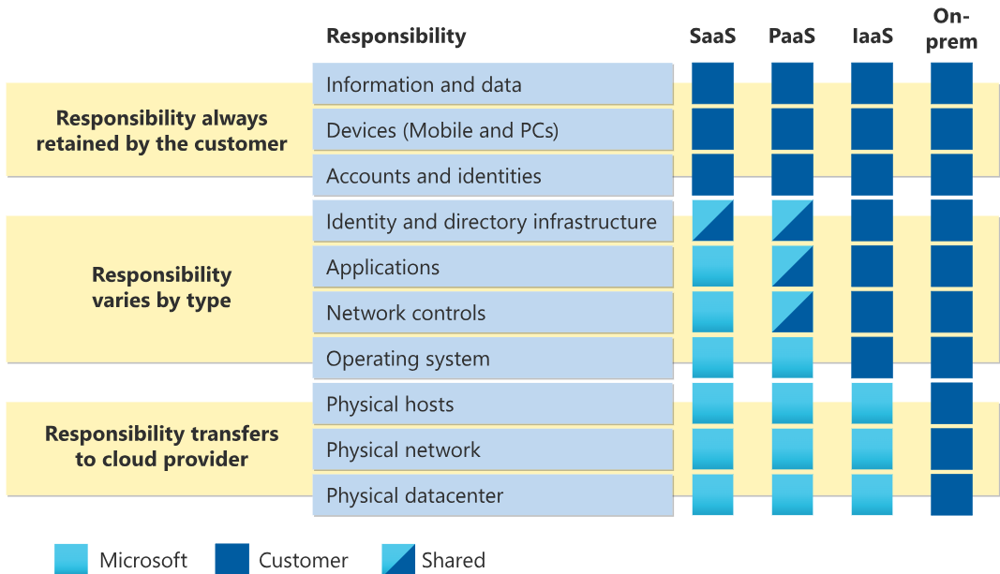
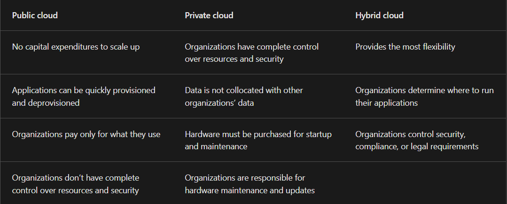

# azure fundamentals

-
-
- Azure Arc
Azure Arc is a set of technologies that helps manage your cloud environment. Azure Arc can help manage your cloud environment, whether it's a public cloud solely on Azure, a private cloud in your datacenter, a hybrid configuration, or even a multi-cloud environment running on multiple cloud providers at once.

- Azure VMware Solution
What if you’re already established with VMware in a private cloud environment but want to migrate to a public or hybrid cloud? Azure VMware Solution lets you run your VMware workloads in Azure with seamless integration and scalability.

- When comparing IT infrastructure models, there are two types of expenses to consider. Capital expenditure (CapEx) and operational expenditure (OpEx).

 -CapEx is typically a one-time, up-front expenditure to purchase or secure tangible resources. A new building, repaving the parking lot, building a datacenter, or buying a company vehicle are examples of CapEx.

 -In contrast, OpEx is spending money on services or products over time. Renting a convention center, leasing a company vehicle, or signing up for cloud services are all examples of OpEx.

 -Cloud computing falls under OpEx because cloud computing operates on a consumption-based model. With cloud computing, you don’t pay for the physical infrastructure, the electricity, the security, or anything else associated with maintaining a datacenter. Instead, you pay for the IT resources you use. If you don’t use any IT resources this month, you don’t pay for any IT resources.

- Scalability
  -Another major benefit of cloud computing is the scalability of cloud resources. Scalability refers to the ability to adjust resources to meet demand. If you suddenly experience peak traffic and your systems are overwhelmed, the ability to scale means you can add more resources to better handle the increased demand.

  -The other benefit of scalability is that you aren't overpaying for services. Because the cloud is a consumption-based model, you only pay for what you use. If demand drops off, you can reduce your resources and thereby reduce your costs.

  -Scaling generally comes in two varieties: vertical and horizontal. Vertical scaling is focused on increasing or decreasing the capabilities of resources. Horizontal scaling is adding or subtracting the number of resources.
    
    --Vertical scaling
     With vertical scaling, if you were developing an app and you needed more processing power, you could vertically scale up to add more CPUs or RAM to the virtual machine. Conversely, if you realized you had over-specified the needs, you could vertically scale down by lowering the CPU or RAM specifications.

    --Horizontal scaling
     With horizontal scaling, if you suddenly experienced a steep jump in demand, your deployed resources could be scaled out (either automatically or manually). For example, you could add additional virtual machines or containers, scaling out. In the same manner, if there was a significant drop in demand, deployed resources could be scaled in (either automatically or manually), scaling in.

- Reliability
     -Reliability is the ability of a system to recover from failures and continue to function. It's also one of the pillars of the Microsoft Azure Well-Architected Framework.

    -The cloud, by virtue of its decentralized design, naturally supports a reliable and resilient infrastructure. With a decentralized design, the cloud enables you to have resources deployed in regions around the world

- Predictability
     Predictability in the cloud lets you move forward with confidence. Predictability can be focused on performance predictability or cost predictability. Both performance and cost predictability are heavily influenced by the Microsoft Azure Well-Architected Framework.

- Performance
     Performance predictability focuses on predicting the resources needed to deliver a positive experience for your customers. Autoscaling, load balancing, and high availability are just some of the cloud concepts that support performance predictability. If you suddenly need more resources, autoscaling can deploy additional resources to meet the demand, and then scale back when the demand drops. Or if the traffic is heavily focused on one area, load balancing will help redirect some of the overload to less stressed areas.

- Cost
     Cost predictability is focused on predicting or forecasting the cost of the cloud spend. With the cloud, you can track your resource use in real time, monitor resources to ensure that you’re using them in the most efficient way, and apply data analytics to find patterns and trends that help better plan resource deployments. By operating in the cloud and using cloud analytics and information, you can predict future costs and adjust your resources as needed. You can even use tools like the Total Cost of Ownership (TCO) or Pricing Calculator to get an estimate of potential cloud spend.

- Things like set templates help ensure that all your deployed resources meet corporate standards and government regulatory requirements. You can update all your deployed resources to new standards as standards change. Cloud-based auditing helps flag any resource that’s out of compliance with your corporate standards and provides mitigation strategies. Depending on your operating model, software patches and updates may also automatically be applied, which helps with both governance and security.

On the security side, you can find a cloud solution that matches your security needs. If you want maximum control of security, infrastructure as a service provides you with physical resources but lets you manage the operating systems and installed software, including patches and maintenance. If you want patches and maintenance taken care of automatically, platform as a service or software as a service deployments may be the best cloud strategies for you.

- Management of the cloud
 Management of the cloud speaks to managing your cloud resources. In the cloud, you can:

 Automatically scale resource deployment based on need.
 Deploy resources based on a preconfigured template, removing the need for manual configuration.
 Monitor the health of resources and automatically replace failing resources.
 Receive automatic alerts based on configured metrics, so you’re aware of performance in real time.

- Some common scenarios where IaaS might make sense include:

 Lift-and-shift migration: You’re setting up cloud resources similar to your on-prem datacenter, and then simply moving the things running on-prem to running on the IaaS infrastructure.
 Testing and development: You have established configurations for development and test environments that you need to rapidly replicate. You can start up or shut down the different environments rapidly with an IaaS structure, while maintaining complete control.

- Platform as a service (PaaS) is a middle ground between renting space in a datacenter (infrastructure as a service) and paying for a deployed  
 solution (software as a service). In a PaaS environment, the cloud provider maintains the physical infrastructure, physical security, and  connection to the internet. They also maintain the operating systems, middleware, development tools, and business intelligence services that make up a cloud solution. In a PaaS scenario, you don't have to worry about the licensing or patching for operating systems and databases.

 PaaS is well suited to provide a complete development environment without the headache of maintaining all the development infrastructure. 
-Some common scenarios where PaaS might make sense include:

 -Development framework: PaaS provides a framework that developers can build upon to develop or customize cloud-based applications. Similar to the way you create an Excel macro, PaaS lets developers create applications using built-in software components. Cloud features such as scalability, high-availability, and multi-tenant capability are included, reducing the amount of coding that developers must do.

 -Analytics or business intelligence: Tools provided as a service with PaaS allow organizations to analyze and mine their data, finding insights and patterns and predicting outcomes to improve forecasting, product design decisions, investment returns, and other business decisions.

- Software as a service (SaaS) is the most complete cloud service model from a product perspective. With SaaS, you’re essentially renting or using 
 a fully developed application. Email, financial software, messaging applications, and connectivity software are all common examples of a SaaS implementation.

 While the SaaS model may be the least flexible, it’s also the easiest to get up and running. It requires the least amount of technical knowledge or expertise to fully employ.

- In a SaaS environment you’re responsible for the data that you put into the system, the devices that you allow to connect to the system, and the 
 users that have access. Nearly everything else falls to the cloud provider. The cloud provider is responsible for physical security of the datacenters, power, network connectivity, and application development and patching.

-