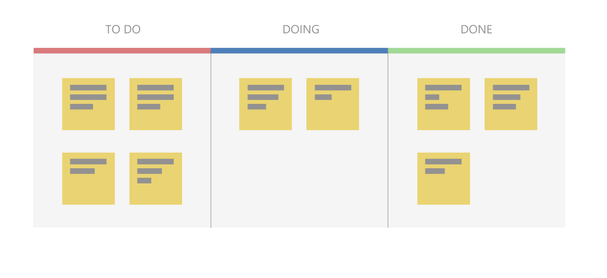
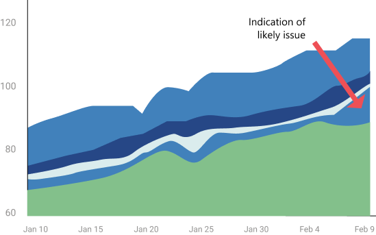
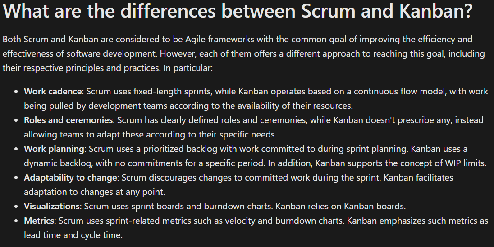
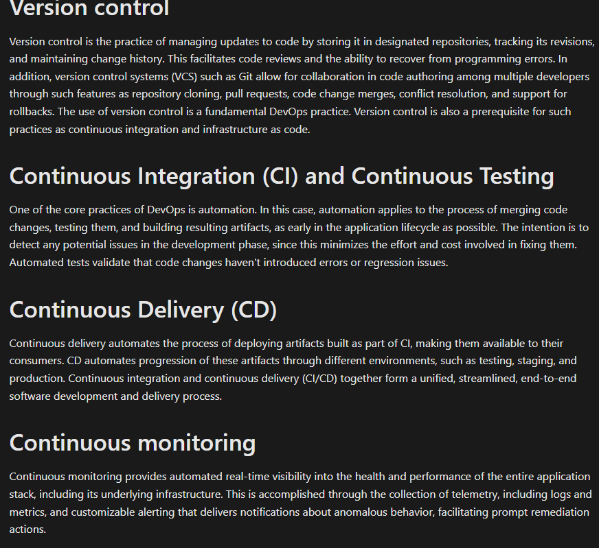
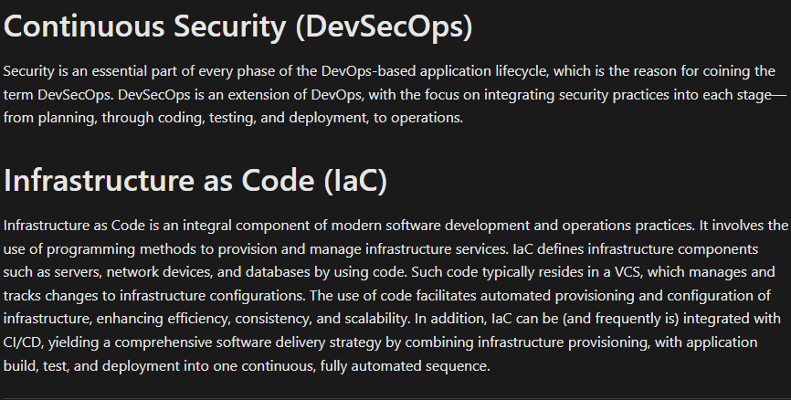

# What is devops
- DevOps is a set of principles, practices, and values that are meant to enhance cross-team synergies, with the common goal of optimizing software delivery.It's not a state that an organization can reach, but rather a continuous journey that requires an ongoing commitment and effort from all stakeholders.It’s also important to note that DevOps isn't tied to a specific technology or tools.

- For one, developers and operational teams have commonly different objectives. The former focuses on innovation and continuous enhancements to their software. The primary objective of the latter is maintaining the stability and security of the environment they support.

- The conflicting goals result in clashes, driving a wedge between different parts of the internal IT organization.The purpose of DevOps is to address these inefficiencies. This is accomplished by uniting people, processes, and technologies. DevOps promotes coordination and collaboration between traditionally siloed roles, spanning such areas as development, operations, quality engineering, and security.

-

# What is DevOps culture?
- DevOps culture encompasses the human and organizational factors that impact software development and delivery. As such, DevOps represents a culture that promotes collaboration, communication, and shared responsibility among all organizational stakeholders.

- The key elements of DevOps culture can be summarized as follows:

 Collaboration Transparency Shared responsibility Continuous learning Measurable outcomes Customer-centric focus Agility Automation Security Integration

# What are the primary goals and benefits of DevOps?

- Accelerating time to market

- Minimizing the mean time to recovery (MTTR)

- Sustaining stability and reliability in operations

-

# Planning
The planning phase involves reviewing customer needs in order to outline and define features and capabilities of the software to be developed.   Such software can range from individual microservices to portfolios consisting of multiple products. The outcome defines software requirements, scope, and milestones for the application's development and deployment. From the DevOps perspective, the primary considerations during this phase include agility, customer-centric focus, alignment, and visibility.

# Development
The development phase covers all aspects of developing application code. These aspects include programming, testing, and code reviews. To comply with DevOps practices, the code should reside in a source control system, which facilitates collaboration and supports versioning. A working version of the code is used to build artifacts suitable for subsequent delivery. Such artifacts can take the form of executable binaries, software libraries, container images, installer packages, configuration files, deployment scripts, or even documentation.

Changes at this phase should be applied in small increments through automated testing and build, referred to as continuous integration (CI), which accelerates the development process and enhances agility.

# Delivery
Delivery is the process of deploying the artifacts built during the development stage into production environments in a consistent and reliable manner. While the ultimate goal at this phase is full automation through continuous delivery (CD), some organizations, especially in early stages of their DevOps adoption, might choose to implement manual approvals or checks. As the confidence in DevOps practices grows, it's typically possible to fully automate these checks. For example, a successful, unattended verification of a deployment to a staging environment might serve as the basis for transitioning to the production environment. Automation helps make delivery processes scalable, repeatable, and, more resilient (by minimizing the possibility of human error). The key to a successful implementation of such an approach is following DevOps practices, including proper testing, the use of observable measurements, and continuous learning.

Delivery should also take into account provisioning and configuring the target environment's infrastructure through IaC. Treating infrastructure as code offers a range of benefits, including consistency, reproducibility, and agility.

# Operations
The operations phase involves maintaining, monitoring, and troubleshooting applications in production environments. From the DevOps perspective, the primary objectives at this stage are stability and reliability, rapid incident response, security and compliance, and customer satisfaction. To some extent, reaching these objectives is dependent on having properly implemented measurable outcomes. DevOps processes also rely on so called feedback loops that deliver data reflecting the current state of the deployed application such as performance metrics, responsiveness, and overall user experience, including improved or degraded functionality.

During this phase, it's important to ensure the maximum levels of collaboration between development, operations, and security teams. This phase also serves as the essential source of continuous learning.

# Agile principles and values
Agile is an approach to software development that promotes team collaboration, continuous improvement, and automation, with the ultimate goal of faster, more reliable, and customer-centric software delivery. The term originated from the Agile Manifesto, created in 2001 by a group of software developers, providing a set of guiding principles for modern software development. The manifesto included four foundational statements that prioritized individuals and interactions, working solutions, and customer collaboration over rigid processes and tools. In particular, these statements assigned more value to:
- Individuals and interactions over processes and tools.
- Working software over comprehensive documentation.
- Customer collaboration over contract negotiation.
- Responding to change over following a plan.

# Agile methods and practices
The Agile Manifesto and Agile principles provide a set of values and guidelines, but they're intentionally not prescriptive in terms of specific methods and practices. Instead, Agile is meant to be flexible and easily adaptable, allowing organizations and teams to choose a more detailed approach according to their preferences and needs.

These detailed, comprehensive approaches are commonly referred to as frameworks. Their purpose is to cover all phases of the DevOps lifecycle, including planning, development, delivery, and operations. Some of the more popular Agile frameworks include Scrum and Kanban.

# What is Scrum?
Scrum is a framework for teams to manage work in short iterations called sprints (1–4 weeks).
Events (ceremonies):

- Daily Scrum (15-min standup)
- Sprint Planning (start), Sprint Review (end), Sprint Retrospective (improve)

Artifacts:

- Product Backlog – prioritized list for the whole project
- Sprint Backlog – list for the current sprint

Task Board – shows tasks as To do / In progress / Done:

- Sprint Burndown Chart – graph tracking remaining work vs. time

Roles:

- Product Owner – defines & prioritizes backlog
- Scrum Master – ensures process, removes blockers
- Scrum Team – builds the product, owns quality

-

# What is Kanban?
- Kanban, meaning "signboard" in Japanese, originated in manufacturing to improve efficiency and is now widely used in software development. It visualizes work on a Kanban board, where tasks are represented as cards arranged in columns (e.g., To-Do, Doing, Done) that can be customized to match the workflow. This makes it easier to track progress, spot bottlenecks, and manage priorities.

-

Unlike Scrum, Kanban is flexible, without fixed iterations. Work follows a pull model: items are added to a backlog, and the team pulls tasks into active work based on priority and capacity. To maintain quality and avoid overload, Kanban limits work in progress (WIP).

Performance is tracked using lead time (total time from request to delivery) and cycle time (time spent actively working on a task). A key tool is the Cumulative Flow Diagram (CFD), which shows the number of tasks in each stage over time. Changes in the size of colored areas on the CFD highlight workflow trends and reveal bottlenecks or inefficiencies.

-

-

-
-
